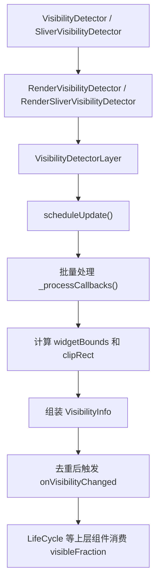

# `visibility_detector.dart` 知识梳理

## 1. 文件定位

`lib/wrapper/visibility_detector.dart` 的职责，可以用一句话概括：

**它负责把“某个 Widget / Sliver 当前到底可见了多少”这件事，从 Flutter 的渲染层算出来，再以批量、节流、可回调的方式交给上层使用。**

在这个仓库里，它不是孤立存在的。`lib/wrapper/life_cycle.dart` 直接依赖它，通过 `visibleFraction` 去决定页面是否进入 `onResume / onPause` 状态。所以它其实是 `LifeCycle` 能成立的底层基础设施。

---

## 2. 先看整体架构

这个文件的实现不是停留在 Widget 层，而是贯穿了四层：

1. **Widget 层**：提供开发者可直接使用的 API。
2. **RenderObject 层**：在绘制阶段把“可见性探测”挂进渲染流程。
3. **Layer 层**：真正计算全局坐标、裁剪区域、可见面积。
4. **Controller 层**：做统一节流、批量派发、状态缓存。

可以把它理解成下面这条链路：



---

## 3. 这个文件里每个核心类是干什么的

| 类 / 类型 | 作用 | 所在层 |
| --- | --- | --- |
| `VisibilityDetector` | 普通 Box Widget 的可见性探测入口 | Widget |
| `SliverVisibilityDetector` | Sliver 场景的可见性探测入口 | Widget |
| `VisibilityChangedCallback` | 可见性变化回调签名 | API |
| `VisibilityInfo` | 一次可见性计算的结果对象 | 数据模型 |
| `RenderVisibilityDetector` | 普通 Widget 对应的渲染桥接层 | RenderObject |
| `RenderSliverVisibilityDetector` | Sliver 对应的渲染桥接层 | RenderObject |
| `VisibilityDetectorLayer` | 真正执行可见性计算、缓存和回调派发的核心 | Layer |
| `VisibilityDetectorController` | 全局配置和控制入口 | Controller |

下面分别拆开讲。

### 3.1 `VisibilityDetector`

这是给普通 Widget 用的入口组件，继承自 `SingleChildRenderObjectWidget`。

它本身很薄，主要做两件事：

1. 接收 `key`、`child`、`onVisibilityChanged`
2. 在 `createRenderObject()` 里创建 `RenderVisibilityDetector`

这说明它本身**不做计算**，只是把“我要监听这个 child 的可见性”这个意图，交给后面的 RenderObject。

### 3.2 `SliverVisibilityDetector`

和 `VisibilityDetector` 思路相同，只是服务对象变成了 Sliver。

之所以要单独做一个 Sliver 版本，是因为 Sliver 的几何信息不是普通 Box 模型，不能只拿一个 `size` 就完事。它要结合：

- `constraints.scrollOffset`
- `constraints.axisDirection`
- `constraints.growthDirection`
- `geometry.scrollExtent`
- `geometry.paintExtent`

也就是说，**普通 Widget 的可见性计算主要围绕矩形尺寸，Sliver 的可见性计算还要额外考虑滚动轴和视口中的偏移关系。**

### 3.3 `VisibilityChangedCallback`

这是回调类型定义：

```dart
typedef VisibilityChangedCallback = void Function(VisibilityInfo info);
```

它规定了：每次可见性变化时，外部拿到的不是零散字段，而是一个完整的 `VisibilityInfo` 对象。

### 3.4 `VisibilityInfo`

这是整个系统对外暴露的“结果模型”，有四个核心认知点：

1. `key`：告诉你是谁变了
2. `size`：原始大小是多少
3. `visibleBounds`：当前可见部分在本地坐标中的矩形
4. `visibleFraction`：可见面积比例，范围在 `0 ~ 1`

它最重要的不是存数据，而是这两个设计：

#### A. `visibleBounds` 使用本地坐标

`fromRects()` 先算全局坐标下的交集，再 `shift(-widgetBounds.topLeft)` 转回本地坐标。

这样做的好处是：

- 如果组件只是位置变了，但可见区域形状没变，就不会被误判成“可见性变化”
- 上层更关心“我这个组件内部哪一块可见”，而不是它在屏幕上的绝对位置

#### B. `visibleFraction` 做了浮点纠偏

`visibleFraction` 内部用 `_floatNear()` 判断是否接近 `0` 或 `1`，避免浮点误差导致：

- 明明完全不可见，却得到 `0.0000001`
- 明明完全可见，却得到 `0.9999997`

所以这里是一个很实际的工程处理，不是数学洁癖。

#### C. `matchesVisibility()`

这个方法专门用于“是否值得再次回调”的判断。

它只比较：

- `size`
- `visibleBounds`

这代表作者想表达的是：

**我们关心的是“可见性语义有没有变化”，而不是对象实例有没有变化。**

---

## 4. 真正的关键：为什么核心逻辑放在 Layer，而不是 Widget 或 RenderObject

文件里有一句非常关键的注释：

> We use a `Layer` because we can directly determine visibility by virtue of being added to the `SceneBuilder`.

这句话的意思可以翻成：

**只有走到 Layer / Scene 这一层，组件最终经过了哪些裁剪、变换、进入没进入最终场景，信息才足够完整。**

如果只在 Widget 层做：

- 拿不到最终渲染时的裁剪链
- 拿不到完整的变换矩阵
- 不知道自己是否真的进入了最终场景

如果只在 RenderObject 层做，也还差一点，因为可见性本质上和 Layer 树、SceneBuilder 的合成结果强相关。

所以这里的分层非常合理：

- `Widget` 负责声明式 API
- `RenderObject` 负责在 paint 阶段插入探测 Layer
- `Layer` 负责最终的几何与裁剪计算

---

## 5. 普通 Widget 的执行链路

### 第一步：`VisibilityDetector` 创建 RenderObject

`createRenderObject()` 返回 `RenderVisibilityDetector`。

### 第二步：`RenderVisibilityDetector.paint()`

这是 Box 版本最关键的入口。

如果 `onVisibilityChanged == null`：

- 不再创建 `VisibilityDetectorLayer`
- 调用 `VisibilityDetectorLayer.forget(key)` 清掉缓存
- 正常 `super.paint()`

如果有回调：

1. 创建 `VisibilityDetectorLayer`
2. 填入 `key`
3. 填入 `widgetSize`
4. 填入 `paintOffset`
5. 用 `context.pushLayer()` 把它压入渲染链

这里的 `widgetSize` 取的是 `semanticBounds.size`，表示当前这个渲染对象的实际语义边界尺寸。

### 第三步：Layer 被 attach / addToScene / detach

`VisibilityDetectorLayer` 在这几个时机都会调用 `_scheduleUpdate()`：

- `attach()`
- `addToScene()`
- `detach()`

这很重要，因为可见性变化不只来自“滚动了一下”，还可能来自：

- 新页面挂上来了
- 旧页面被移除了
- 组件重新挂载
- 组件从树上分离

也就是说，这个系统不是只盯着 `paint()`，而是盯着**生命周期 + 合成时机**。

---

## 6. `VisibilityDetectorLayer` 才是整个文件的心脏

这个类承担了四类工作：

1. 计算组件全局边界
2. 计算组件最终裁剪区域
3. 批量调度与节流
4. 去重并触发回调

### 6.1 它维护了哪些全局静态状态

#### `_timer`

用来控制节流。

#### `_updated`

类型是 `Map<Key, VisibilityDetectorLayer>`。

含义是：最近被更新过、后续需要检查是否触发回调的 layer 集合。

之所以用 `Map<Key, Layer>` 而不是 `List`，是为了：

- 同一个 key 的多次更新只保留最后一次
- 如果 layout 变化导致新 layer 替换旧 layer，也能覆盖到最新实例

#### `_lastVisibility`

类型是 `Map<Key, VisibilityInfo>`。

保存某个 key 上次已确认的可见性结果，用来做去重。

注意这个 map **只保存当前可见的项**。一旦完全不可见，会主动删除，避免内存无限增长。

#### `_lastBounds`

保存最近一次的全局矩形边界，供 `VisibilityDetectorController.widgetBoundsFor()` 查询。

同样，只保留还可见的组件。

---

## 7. 可见性到底是怎么算出来的

### 7.1 先算组件自身的全局矩形：`_computeWidgetBounds()`

```dart
Rect _computeWidgetBounds() {
  return _localRectToGlobal(this, paintOffset + widgetOffset & widgetSize);
}
```

这里的核心是：

- 先在当前 layer 的局部坐标里构造出组件矩形
- 再通过 `_localRectToGlobal()` 变换到全局坐标

其中：

- `paintOffset`：当前 paint 的偏移
- `widgetOffset`：组件本体在局部坐标中的偏移
- `widgetSize`：组件大小

对于普通 Box，`widgetOffset` 是 `Offset.zero`。

### 7.2 `_localRectToGlobal()` 如何完成坐标转换

这一步依赖两个辅助函数：

- `_getLayerChain()`：拿到从当前 layer 一直到根的祖先链
- `_accumulateTransforms()`：把这条链上的变换矩阵累乘起来

最终通过：

```dart
MatrixUtils.transformRect(transform, localRect)
```

把局部矩形变成全局矩形。

有一个非常值得注意的细节：

源码会跳过根 `TransformLayer`，因为根层的变换通常是“逻辑像素 -> 物理像素”。这里要计算的是 Flutter 逻辑坐标系下的可见性，不应该把设备像素变换混进来。

### 7.3 再算最终裁剪矩形：`_computeClipRect()`

这个函数的逻辑非常像“沿着祖先链把所有裁剪区域一层层求交集”。

初始裁剪区域来自：

- `RendererBinding.instance.renderViews.first.size`

也就是整个渲染视图的大小。

然后不断向上遍历 `parentLayer`，遇到这些 Layer 就取出裁剪信息：

- `ClipRectLayer`
- `ClipRRectLayer`
- `ClipPathLayer`

每遇到一个，就把它的裁剪区域先转成全局坐标，再与当前 `clipRect` 做 `intersect()`。

最后得到的是：

**当前组件在所有祖先裁剪条件共同作用下，理论上最多还能看见的那块区域。**

### 7.4 最终得到 `VisibilityInfo`

`_processCallbacks()` 里会做：

1. 算 `widgetBounds`
2. 算 `clipRect`
3. 调 `VisibilityInfo.fromRects()`

`fromRects()` 的本质是：

- 若有交集：取交集
- 若无交集：`Rect.zero`

然后把交集转回组件本地坐标，最终形成 `visibleBounds`。

---

## 8. 为什么回调不是立刻触发，而是“延迟 + 批量”

这部分是这个实现里非常成熟的一点。

### 8.1 `_scheduleUpdate()`

每次 layer 变化时，并不会马上调用回调，而是先把自己放进 `_updated`。

然后根据 `VisibilityDetectorController.instance.updateInterval` 选择策略：

#### 情况 A：`updateInterval == Duration.zero`

不会立刻执行，而是注册 `addPostFrameCallback()`，在本帧结束后统一处理。

这么做的目的有两个：

1. 保证从一致的渲染状态读数据
2. 避免在 frame 中途修改 widget tree

这也是为什么测试里经常把它设成 `Duration.zero`，因为这样更“快”，但依然安全。

#### 情况 B：`updateInterval > 0`

创建一个普通 `Timer`，时间到了以后走 `_handleTimer()`。

`_handleTimer()` 再通过：

```dart
SchedulerBinding.instance.scheduleTask<void>(_processCallbacks, Priority.touch);
```

把实际处理安排到帧与帧之间，而不是直接在 timer 回调里硬算。

### 8.2 这么设计的收益

1. **节流**：滚动过程中不会每一丁点变化都回调
2. **合并**：同一批 frame 内的多个变化会合并处理
3. **一致性**：读取到的是更稳定的最终渲染状态
4. **安全性**：避免在 paint / layout 过程中直接改树

---

## 9. 回调什么时候会真正触发

核心逻辑在 `_fireCallback()`。

### 9.1 第一次就是不可见，不回调

如果 `oldInfo == null`，并且这次 `visibleBounds.isEmpty`，直接返回。

也就是说：

**一个组件刚创建出来但本来就不可见，不会因为“不可见”而多打一枪回调。**

### 9.2 和上次结果等价，不回调

如果 `info.matchesVisibility(oldInfo)`，直接返回。

说明作者明确不想把“没有实际变化的重复计算”暴露给上层。

### 9.3 只有真正变化才回调

- 可见：写入 `_lastVisibility`
- 不可见：移除 `_lastVisibility` 和 `_lastBounds`
- 然后执行 `onVisibilityChanged(info)`

这形成了一个很清晰的语义：

- 从不可见变可见：回调
- 从可见变不可见：回调
- 可见比例改变：回调
- 状态没变：不回调

---

## 10. 组件被移除时怎么处理

`_processCallbacks()` 有一个很容易被忽略但很关键的分支：

```dart
if (!layer.attached) {
  layer._fireCallback(VisibilityInfo(
      key: layer.key, size: _lastVisibility[layer.key]?.size));
  continue;
}
```

意思是：

如果这个 layer 已经不在树上了，那它很可能已经不可见，于是构造一个 `visibleBounds = Rect.zero` 的 `VisibilityInfo` 去做收尾通知。

这能解决一个很现实的问题：

**组件不是靠滚出屏幕消失，而是直接被从树上摘掉了。**

如果没有这段逻辑，上层可能永远收不到“它已经不可见了”的最后一次通知。

---

## 11. Sliver 版本为什么更复杂

`RenderSliverVisibilityDetector` 的思路和 Box 版一致，也是：

1. paint 时创建 `VisibilityDetectorLayer`
2. 把几何信息交给 layer 算

但它多了一个关键步骤：先根据滚动方向推导 `widgetOffset` 和 `widgetSize`。

它通过：

```dart
applyGrowthDirectionToAxisDirection(
  constraints.axisDirection,
  constraints.growthDirection,
)
```

先把真实轴方向算出来，然后分别处理：

- `AxisDirection.down`
- `AxisDirection.up`
- `AxisDirection.right`
- `AxisDirection.left`

本质上，它是在回答两个问题：

1. 这个 sliver 的“整体内容矩形”有多大
2. 这块矩形相对当前 viewport 起点偏到了哪里

这样 layer 后面才能像普通矩形一样继续走统一算法。

换句话说：

**Sliver 版本的难点，不在可见性计算本身，而在“先把 Sliver 几何还原成一个可计算的矩形”。**

---

## 12. `VisibilityDetectorController` 的角色

这是一个单例控制器，用来管理整个系统的外部控制接口。

### 12.1 `updateInterval`

默认 `500ms`。

含义是：同一批 detector 的回调，最短间隔不要小于这个时间。

适合线上滚动场景，避免高频抖动。

### 12.2 `notifyNow()`

立刻清掉 timer，并马上处理当前所有待派发的回调。

适合：

- 页面切换前
- widget tree 即将销毁前
- 测试里想立刻拿到结果时

### 12.3 `forget(Key key)`

清除某个 detector 对应的缓存和待处理状态。

适合：

- 测试结束清理
- 某个 detector 被销毁后不想留下挂起 timer

### 12.4 `widgetBoundsFor(Key key)`

返回最近一次记录的全局边界。

注意它不是实时重新计算，而是读缓存；而且如果组件当前不可见，这里可能拿不到值。

---

## 13. 这个文件和 `life_cycle.dart` 的关系

在 `life_cycle.dart` 里，`build()` 直接包了一层：

```dart
VisibilityDetector(
  key: _visibilityDetectorKey,
  onVisibilityChanged: (visibilityInfo) {
    final visibleFraction = visibilityInfo.visibleFraction;
    ...
  },
  child: widget.child,
)
```

也就是说，`LifeCycle` 的页面前后台感知其实分成了两个维度：

1. **App 维度**：`WidgetsBindingObserver` 监听前后台
2. **页面可见维度**：`VisibilityDetector` 监听当前页面是否真的还能看到

最终 `LifeCycle` 的 `onResume / onPause`，依赖的是两者组合，而不是只看 App 生命周期。

这也是这个库比“只监听 AppLifecycleState”更细的一点。

---

## 14. 这份实现最值得记住的设计点

### 14.1 它检测的是“几何可见性”，不是“语义可见性”

从源码实现可以推断，这里关注的是：

- 组件是否进入最终场景
- 组件矩形与裁剪链交集还有多少

它**没有**直接处理这些维度：

- 被兄弟节点完全遮挡
- 透明度为 0
- 复杂非矩形区域的真实像素级可见性
- 组件内容被其它绘制结果覆盖

所以它更准确地说，是一个**基于矩形边界、裁剪链、Layer 合成时机的可见性检测器**。

### 14.2 它优先保证“稳定”和“可批量处理”

这份实现并不追求每一次滚动像素变化都立即回调，而是追求：

- 回调语义稳定
- 不在错误时机触发
- 批量处理成本可控

这是非常偏工程化的选择。

### 14.3 它把“坐标变换问题”隔离得很好

坐标变换这部分被独立封装成：

- `_getLayerChain()`
- `_accumulateTransforms()`
- `_localRectToGlobal()`

所以主流程读起来是清楚的：

- 先算组件矩形
- 再算裁剪矩形
- 再求交集
- 再派发结果

这让文件虽然处在渲染层，但可读性还不错。

---

## 15. 一句话总结实现原理

`visibility_detector.dart` 的实现原理，本质上就是：

**在 paint 阶段为目标组件插入一个自定义 Layer；等 Layer 进入场景后，结合变换链和祖先裁剪链，算出组件矩形与可视区域的交集；再把结果缓存、节流、去重后，以 `VisibilityInfo` 的形式批量回调给上层。**

如果再压缩一点：

**Widget 只负责声明，RenderObject 负责接线，Layer 负责计算，Controller 负责调度。**

---

## 16. 阅读这个文件时的推荐抓手
推荐按这个顺序重读源码：

1. `VisibilityInfo`
2. `RenderVisibilityDetector.paint()`
3. `VisibilityDetectorLayer._scheduleUpdate()`
4. `VisibilityDetectorLayer._processCallbacks()`
5. `VisibilityDetectorLayer._computeWidgetBounds()`
6. `VisibilityDetectorLayer._computeClipRect()`
7. `RenderSliverVisibilityDetector.paint()`
8. `VisibilityDetectorController`

按这个顺序读，会比从头到尾线性扫更容易抓住主干。
